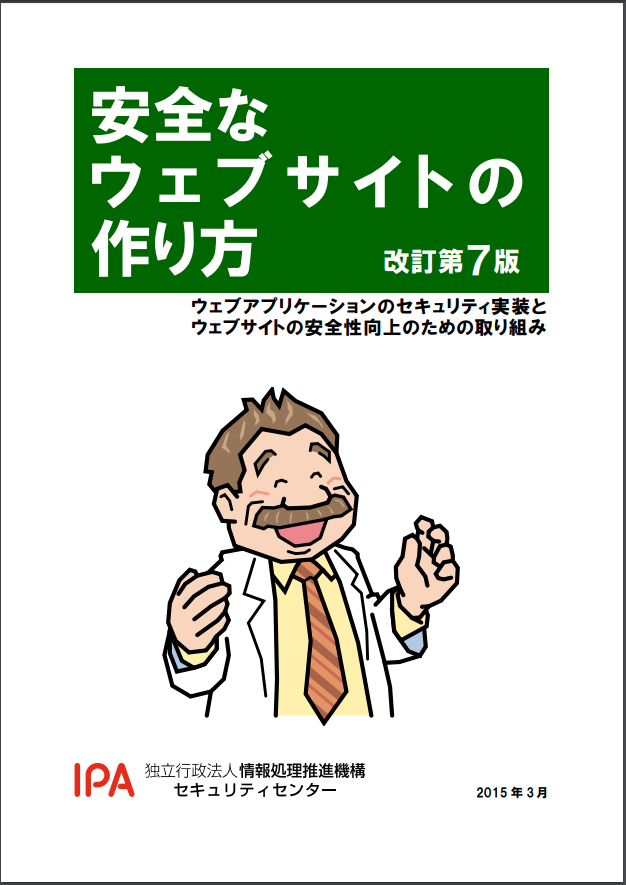
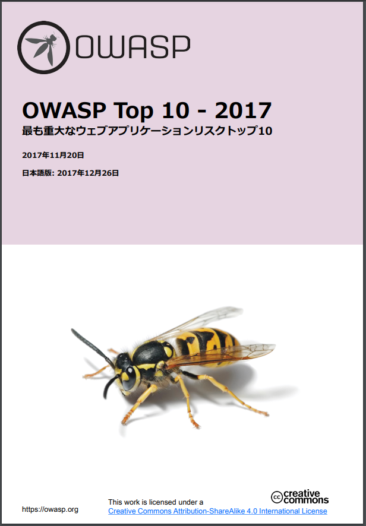

### 安全なWebアプリケーションの作り方
~Webアプリケーションの脆弱性とは~

---

### 自己紹介

| 項目   | 説明                             |
|--------|----------------------------------|
| 名前   | 今村昌平                         |
| 職業   | 受託Web開発 SE（そろそろ３年目） |
| 特技   | カラオケ、筋トレ                 |
| 脆弱性 | お酒（梅酒以外）                 |

--

### 本ドキュメントについて

- Weeyble 勉強会のための資料です
- 権利関係で問題がありましたら、ご連絡ください

---

### 脆弱性とは

__悪用できる__ バグ

バグとは：プログラミング上の誤りのこと

悪用とは：（本来の目的・用途に反して）悪い事に利用すること

--

### 具体的な悪用例

- 個人情報はどの秘密情報を勝手に閲覧
- Webサイトの内容を書き換える
- サイトを閲覧した利用者のPCをウイルスに感染させる
- 別の利用者になりすまし、秘密情報の閲覧、投稿、買い物、送金などを行う
- ...

---

### 管理者にとっての不利益

- 経済的な損失
  - 利用者、取引先が受けた金銭的損失の補填、補償
  - Webサイト停止による機会損失等
- 信用の失墜
- 反社会勢力への加担
  - 攻撃インフラ（ボットネットワーク）構築

--

#### 法的な要求事項

- 個人情報の保護に関する法律 （[参考](https://www.ppc.go.jp/files/pdf/290530_personal_law.pdf)）

```
（安全管理措置）
第20条 個人情報取扱事業者は、その取り扱う個人データの漏えい、滅失又はき損
の防止その他の個人データの安全管理のために必要かつ適切な措置を講じなけれ
ばならない。
```
```
（勧告及び命令）
第42条 個人情報保護委員会は、個人情報取扱事業者が第16条から第18条まで、第
20条から第22条まで、第23条（第４項を除く。）、第24条、第25条、第26条（第
２項を除く。）、第27条、第28条（第１項を除く。）、第29条第２項若しくは第
３項、第30条第２項、第４項若しくは第５項、第33条第２項若しくは第36条（第
６項を除く。）の規定に違反した場合又は匿名加工情報取扱事業者が第37条若し
くは第38条の規定に違反した場合において個人の権利利益を保護するため必要が
あると認めるときは、当該個人情報取扱事業者等に対し、当該違反行為の中止そ
の他違反を是正するために必要な措置をとるべき旨を勧告することができる。
```

---

### なぜ脆弱性が生まれるのか


--

### 本書の構成


---

### セキュリティガイドライン




--

#### セキュリティガイドライン参考リンク

- [安全なウェブサイトの作り方](https://www.ipa.go.jp/files/000017316.pdf)
- [OWASP_Top_10-2017](https://www.owasp.org/images/2/23/OWASP_Top_10-2017%28ja%29.pdf)
